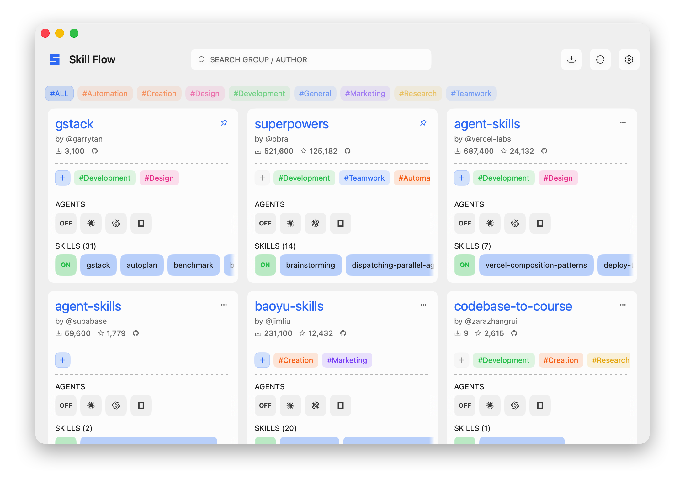
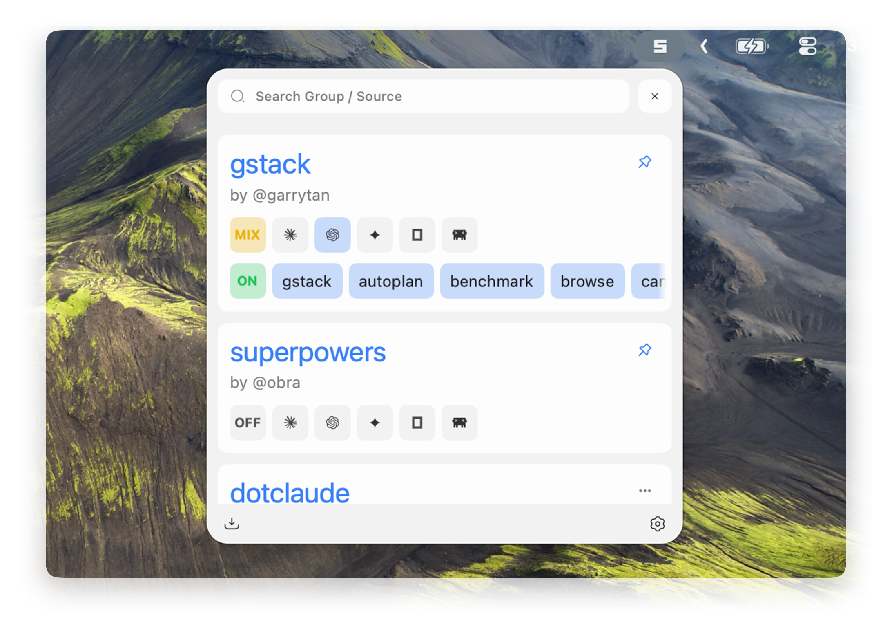
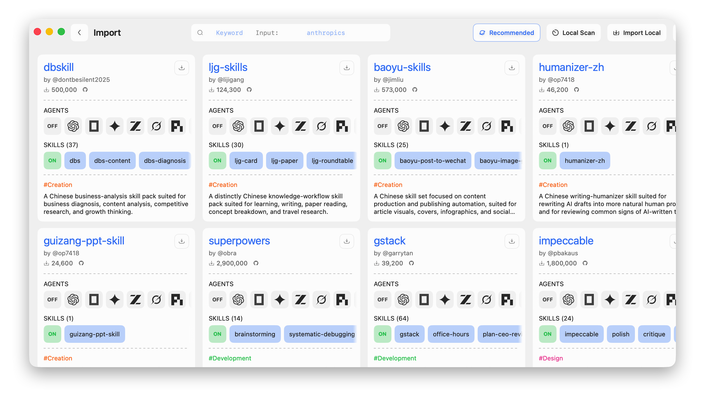
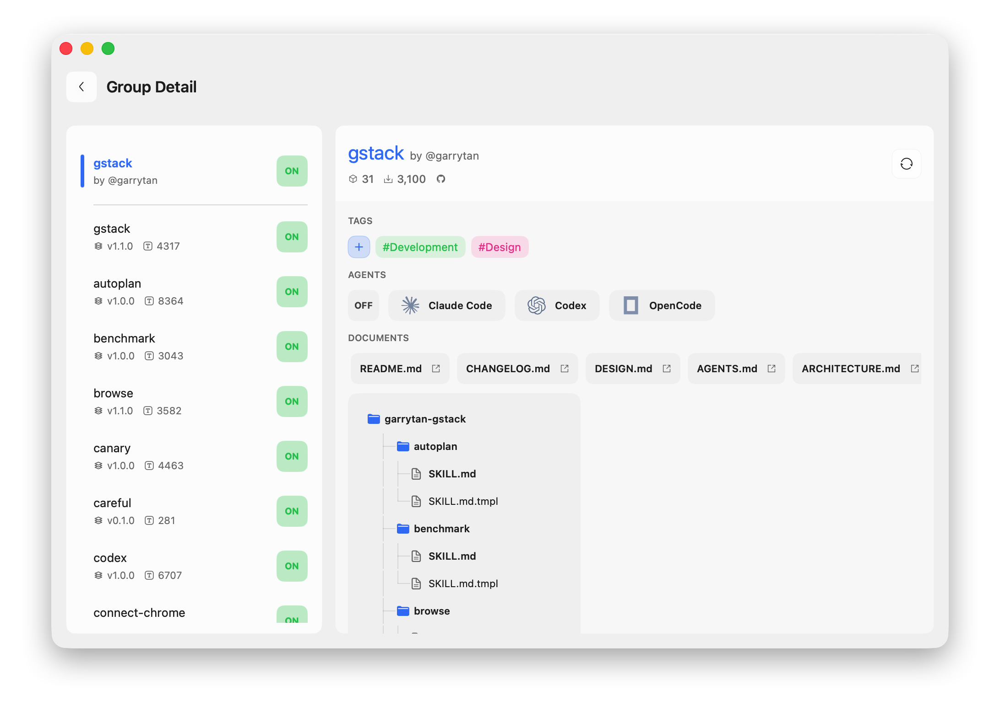
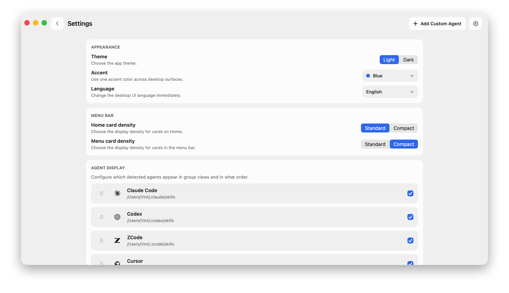

# Skill Flow

<div align="center">

散在する AI エージェントスキルを整理されたワークフローに。

[English](./README.md) · [中文](./README.zh.md)

[](https://nodejs.org)
[](https://www.npmjs.com/package/skill-flow)
[](./LICENSE)


</div>

すべての主要なコーディングエージェントでスキルをインストール、管理、共有 —— Claude Code、Cursor、Grok Build、Copilot、Trae、Trae CN、ZCode など。

skills.sh、GitHub、またはローカルソースからスキルを検索してインポート。複数のエージェントに一度にデプロイ。すべてを整理して最新の状態に保つ。



## なぜこれが存在するのか

スキルを一つずつインストールすることは、規模が大きくなると破綻します：

- リポジトリには複数の関連スキルが含まれているが、個別にインストールする
- 異なるエージェントは異なる場所を期待する
- 更新が静かにドリフトする
- 管理されていないフォルダが蓄積される
- 実際に何がデプロイされているか誰も追跡していない

`skill-flow` はワークフローグループを保持します。一つのソースは一つのまとまりのあるユニットのまま——検査し、スキルを選択し、複数のターゲットにデプロイし、クリーンに更新し、常に状態を把握できます。

## 主な機能

- **グループ化されたソース管理**: ローカル、Git、skills.sh ソースはすべて同じインポートモデルを通じて流れます。
- **マルチエージェントデプロイ**: 選択した一つのスキルセットを Claude Code、Codex、Cursor、Grok Build、Gemini CLI、OpenCode、OpenClaw、Hermes Agent、MiniMax Code、Trae、Trae CN、Windsurf、ZCode などにデプロイします。
- **インタラクティブな設定フロー**: add/config フロー、選択状態、レビュー、修復のための Ink ベース TUI。
- **macOS 15+ デスクトップアプリ**: SwiftUI メインウィンドウ、インポートビュー、詳細パネル、設定、メニューバークイック設定。
- **明示的な状態**: `manifest.json` は意図を保存し、`lock.json` は解決されたインベントリとデプロイメントを保存します。
- **ブリッジプロトコル**: `skill-flow bridge --json` を介した機械可読デスクトップ/ヘルパーエントリポイント。
- **修復と診断**: `doctor`、`repair-source`、`repair-state`、`repair-targets` が通常最初に腐る部分をカバーします。

## インターフェースプレビュー

| メニューバー | インポート |
| --- | --- |
|  |  |

| 詳細 | 設定 |
| --- | --- |
|  |  |

## クイックスタート

### インストール

```bash
npm install -g skill-flow
skill-flow --help
```

またはグローバルインストールなしで実行：

```bash
npx skill-flow --help
```

### デスクトップ版の前提依存

Skill Flow Desktop は現在、対象の Mac 上でいくつかの外部コマンドラインツールに依存します。

- 同梱 desktop helper の起動には `node` 20 以上が必要です
- GitHub 以外の Git ソースを扱うには `git` が必要です
- skills.sh ソースを扱うには `npx` が必要です

デスクトップアプリが依存不足を検出した場合は、実行可能なエラーメッセージを表示し、この節へ案内します。

### 典型的なフロー

```bash
# ソースを追加
skill-flow add garrytan/gstack

# インストールされたワークフローグループをレビュー
skill-flow list

# インタラクティブな設定 UI を開く
skill-flow config

# インストールされたスキル、組み込みカタログ、skills.sh を検索
skill-flow find browser

# 一つのソースまたはすべてのソースを更新
skill-flow update garrytan-gstack
skill-flow update --all

# ドリフトまたは壊れたプロジェクションを診断
skill-flow doctor
```

### マシンブリッジ

デスクトップアプリとヘルパーツールは、バージョン管理された JSON プロトコルを通じて CLI と通信します：

```bash
printf '%s' '{"protocolVersion":"1.0","command":"list"}' | skill-flow bridge --json
```

## サポートされているソース

`skill-flow add <source>` は以下をサポートします：

- ローカルフォルダ
- `owner/repo` GitHub 短縮形
- 完全な HTTPS Git URL
- SSH Git URL
- GitHub ツリー URL
- `clawhub:<slug>[@version]`

例：

```bash
skill-flow add ~/code/my-skills
skill-flow add garrytan/gstack
skill-flow add https://github.com/garrytan/gstack.git
skill-flow add git@github.com:garrytan/gstack.git
skill-flow add https://github.com/garrytan/gstack/tree/main/skills
skill-flow add clawhub:example/skill-pack
skill-flow add clawhub:example/skill-pack@1.2.3
```

リポジトリが大きいが、デフォルトの選択を一つのサブツリーから開始する場合は、`--path <repoSubpath>` を使用します。

## サポートされているターゲット

現在の組み込みターゲット：

- Claude Code
- Codex
- ZCode
- Cursor
- Grok Build
- Pi
- WorkBuddy
- CodeBuddy
- Trae
- Trae CN
- Kimi Code
- OpenCode
- MiniMax Code
- Hermes Agent
- OpenClaw
- GitHub Copilot
- Gemini CLI
- Windsurf
- Amp
- Kiro
- Roo Code
- Cline
- DeepSeek Harness
- Antigravity
- Junie
- Mistral Vibe
- OpenHands
- Qoder
- Qwen Code
- Zencoder
- Kilo Code
- Goose

ターゲットパスは `SKILL_FLOW_TARGET_*` 環境変数でオーバーライドできます。

## コマンドマップ

| コマンド | 機能 |
| --- | --- |
| `add <source>` | ソースをインポートし、スキル/ターゲットを選択 |
| `list` | ワークフローグループと現在の健全性を表示 |
| `list --ids --warnings` | 移行や調査用にソース ID と警告詳細を表示 |
| `enable <sourceIds...> --targets <ids> --all-skills` | 登録済みグループのターゲットを有効化。`--all-skills` は空のスキル選択を先に埋めます |
| `disable <sourceIds...>` | アンインストールせずにグループを OFF にする |
| `only <sourceIds...> --targets <ids> --all-skills` | 指定したグループだけを ON にする。`--all-skills` は空のスキル選択を先に埋めます |
| `import-manifest <file>` | ソース manifest を一括インポート。`targets` を持つ JSON entry には `skills: "all"` が必要 |
| `find <query>` / `search <query>` | インストールされたスキル、組み込み Git カタログ、skills.sh を検索 |
| `config` | インタラクティブな設定 UI を開く |
| `update [sourceId] --all` | 一つのソースまたはすべての登録されたソースを更新 |
| `doctor` | ドリフト、欠落パス、プロジェクション問題を診断 |
| `repair-source [sourceId] --all` | ソースチェックアウトメタデータを再構築 |
| `repair-state [sourceId] --all` | ソース側の状態を再構築 |
| `repair-targets [sourceId] --all` | プロジェクトされたターゲットコンテンツを修復 |
| `uninstall <sourceIds...>` | グループとそのデプロイメントを削除 |
| `bridge --json` | マシンプロトコルリクエストを実行 |

## 状態の仕組み

`skill-flow` は一つの状態ルートを保持し、デフォルトは `~/.skillflow/` です。

- `manifest.json`: あなたが望むもの
- `lock.json`: 実際にインストールされているもの
- `source/local/*`: インポートされたローカルまたは採用された管理されていないソース
- `source/git/*`: Git ソースキャッシュ
- `source/clawhub/*`: skills.sh ソースキャッシュ
- `catalog/git/*`: 組み込み Git カタログキャッシュ

ターゲットディレクトリはデプロイメント出力であり、真実のソースではありません。

## FAQ

### `skill-flow` はどこにデータを保存しますか？

デフォルトでは、状態は `~/.skillflow/` の下に存在します。`manifest.json` は望むワークフローを記録し、`lock.json` は解決されたインベントリとデプロイメントを記録し、`source/*` ディレクトリはインポートされたソースをキャッシュします。

### デプロイメントはターゲットエージェントフォルダ内のファイルを上書きしますか？

`skill-flow` はターゲットディレクトリをデプロイメント出力として扱います。ワークフローグループの選択されたスキルは状態からそこにプロジェクトされるため、これらのファイルは真実のソースとして編集するのではなく、生成された結果として扱う必要があります。

### `doctor` と `repair-*` をいつ使用すべきですか？

何かがおかしいと思われ、最初に診断が必要な場合は `skill-flow doctor` から始めます。ソースチェックアウトメタデータが壊れている場合は `repair-source`、ソース側の状態を再構築する必要がある場合は `repair-state`、デプロイされたターゲットコンテンツが現在の状態からドリフトしている場合は `repair-targets` を使用します。

## モノレポレイアウト

```text
.
├── apps
│   ├── cli/                    # 公開された npm パッケージと CLI エントリポイント
│   └── desktop-mac/            # macOS 15+ 用 SwiftUI デスクトップアプリ
├── packages
│   ├── core-engine/            # インベントリ、デプロイメント、doctor、ブートストラップサービス
│   ├── domain/                 # ドメインモデルとコアタイプ
│   ├── integration/            # Git、GitHub、skills.sh、パス、命名統合
│   ├── query/                  # 共有ランタイムとブリッジ向けオーケストレーション
│   ├── shared-types/           # ブリッジプロトコルタイプ
│   ├── storage/                # manifest、lock、preferences、キャッシュ永続化
│   └── tui/                    # Ink add/find/config UI
├── docs/                       # アーキテクチャ、コントリビュータードキュメント、リファレンス、プラン
└── releases/                   # リリースノート
```

## 開発

```bash
npm install
npm run build
npm test
```

CLI 開発ループ：

```bash
npm run -w skill-flow dev -- --help
```

デスクトップ開発ループ：

```bash
npm run build
cd apps/desktop-mac
swift build
swift test
```

ローカル CLI ビルドに対してデスクトップシェルをデバッグ：

```bash
export SKILL_FLOW_DESKTOP_HELPER_OVERRIDE=/absolute/path/to/apps/cli/dist/cli.js
```

## Star History

[](https://www.star-history.com/#VintLin/skill-flow&Date)

## ライセンス

Apache License 2.0。[LICENSE](./LICENSE) を参照してください。
