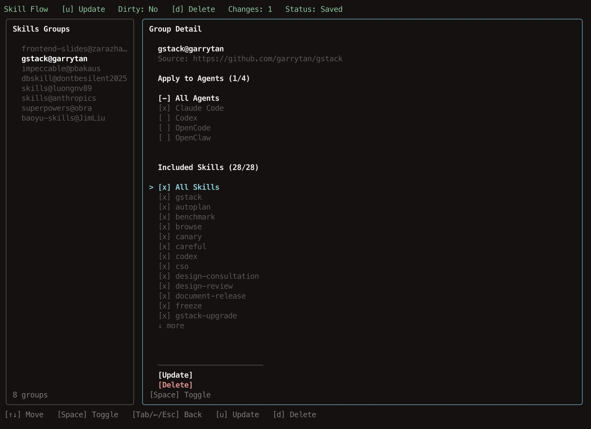

# Skill Flow

> **Workflow-first management for AI agent skills.**
> Skill grouping · Deploy everywhere · Clear config · Quick diagnosis



[中文文档](./README.zh.md)

[](https://nodejs.org)
[](./LICENSE)

As your AI agent skills grow, management gets messy: one Git repo has a bunch of related skills, they end up scattered across different agents, and updates become a headache.

`skill-flow` fixes this by organizing skills around groups: add skill groups from Git repos, pick where to deploy, update all at once, spot problems fast. Keep your skill setup clean, organized, and stress-free.

## Key Features


**Skill-Based Grouping**
One Git repo = one skills group. Related skills stay together, updates and maintenance happen at the group level.

**Deploy Everywhere**
Set it up once, deploy to multiple agents (Claude Code, Cursor, Windsurf, and 13+ targets).

**Interactive Terminal UI**
Intuitive TUI: view groups → select skills → choose targets → save configuration.

**Explicit State Tracking**
`manifest.json` = what you want, `lock.json` = what's actually installed. Both are readable and queryable.

**Health Diagnosis**
`doctor` catches broken links, mismatches, and conflicts — tells you exactly what's wrong.

## Installation

Requires Node.js >= 20, currently optimized for macOS.

Install from npm:

```bash
npm install -g skill-flow
skill-flow --help
```

Run without a global install:

```bash
npx skill-flow --help
```

Install from source for local development:

```bash
git clone https://github.com/VintLin/skill-flow.git
cd skill-flow
npm install
npm run build
npm link
```

## Quick Start

```bash
# Add a skill source
skill-flow add /path/to/skills-repo

# View skills groups
skill-flow list

# Interactive configuration (select skills and targets)
skill-flow config

# Update all sources
skill-flow update --all

# Health check
skill-flow doctor

# Remove a skills group
skill-flow uninstall my-source-id
```

`add <source>` supports local paths, `owner/repo`, full https/ssh Git URLs, GitHub tree URLs, and `clawhub:<slug>[@version]`.

By default, `add` preselects all discovered skills and all detected agent targets. When `--path <repoSubpath>` is provided, the full repo is still imported, but only skills under that path are preselected.

Examples:

```bash
# Local repo
skill-flow add ~/code/my-skills

# GitHub shorthand
skill-flow add garrytan/gstack

# Full Git URL
skill-flow add https://github.com/garrytan/gstack.git
skill-flow add git@github.com:garrytan/gstack.git

# GitHub tree URL
skill-flow add https://github.com/garrytan/gstack/tree/main/skills

# Import the repo, but only preselect skills under a subpath
skill-flow add garrytan/gstack --path skills

# ClawHub package
skill-flow add clawhub:example/skill-pack
skill-flow add clawhub:example/skill-pack@1.2.3
```

## Command Reference

| Command | Description |
|---|---|
| `add <source>` | Add a skill source (Git repo or ClawHub) |
| `find <query>` | Search installed skills, built-in Git catalogs, and ClawHub |
| `search <query>` | Alias of `find` |
| `list` | Show skills groups |
| `config` | Open interactive configuration UI |
| `update [sourceId] --all` | Update all skills and re-deploy |
| `doctor` | Check for problems |
| `uninstall <sourceIds...>` | Remove skills groups and their deployments |

When selected skills collide by name, `skill-flow` keeps identical duplicates as warnings and renames different-content collisions with repo/author-prefixed link names such as `gstack-browse`, `gstack(garrytan)-browse`, or `garrytan-skill-creator`.

## How It Works

**State Management**
- `~/.skillflow/manifest.json` - Your configuration (what you want)
- `~/.skillflow/lock.json` - Actual state (what's installed)
- `~/.skillflow/source/git/<source-id>/` - Git repo cache
- `~/.skillflow/source/clawhub/<source-id>/` - ClawHub cache
- `~/.skillflow/catalog/git/<source-id>/` - Built-in Git catalog cache

**Deployment Strategy**
Uses symlinks when possible, file copies when needed. Target directories are just deploy points — real state lives in lock.json.

## Supported Agents

Claude Code · Codex · Cursor · GitHub Copilot · Gemini CLI · OpenCode · OpenClaw · Pi · Windsurf · Roo Code · Cline · Amp · Kiro

Customize target paths via environment variables (e.g., `SKILL_FLOW_TARGET_CLAUDE_CODE`).

Broader ecosystem path references, including project-level rules and instructions paths (docs TBD).

## Built-in Discovery Catalogs

`find/search` searches built-in Git catalogs in addition to local installed skills and ClawHub.

For more reliable built-in Git catalog search, set `GITHUB_TOKEN` to avoid low unauthenticated GitHub API rate limits.

| Repository | Description | Stars | Skills |
| --- | --- | ---: | ---: |
| [anthropic-skills](https://github.com/anthropics/skills) | Official Agent Skills from Anthropic | 95,957 | 18 |
| [superpowers](https://github.com/obra/superpowers) | Agentic skills framework & development methodology | 89,816 | 14 |
| [everything-claude-code](https://github.com/affaan-m/everything-claude-code) | Performance optimization system for Claude Code, Codex, and beyond | 81,392 | 147 |
| [agency-agents](https://github.com/msitarzewski/agency-agents) | Specialized expert agents with personality and proven deliverables | 50,749 | — |
| [ui-ux-pro-max-skill](https://github.com/nextlevelbuilder/ui-ux-pro-max-skill) | Design intelligence for building professional UI/UX | 43,112 | 7 |
| [antigravity-awesome-skills](https://github.com/sickn33/antigravity-awesome-skills) | 1,000+ battle-tested skills for Claude Code, Cursor, and more | 25,047 | 1,258 |
| [marketingskills](https://github.com/coreyhaines31/marketingskills) | Marketing skills — CRO, copywriting, SEO, analytics, growth | 14,099 | 33 |
| [agentskills](https://github.com/agentskills/agentskills) | Specification and documentation for Agent Skills | 13,342 | — |
| [taste-skill](https://github.com/Leonxlnx/taste-skill) | Gives your AI good taste — stops generic, boring output | 3,389 | 5 |
| [affiliate-skills](https://github.com/Affitor/affiliate-skills) | Full affiliate marketing funnel: research to deploy | 99 | 47 |
| [skills](https://github.com/luongnv89/skills) | Reusable skills to supercharge your AI agents | 1 | 29 |
| [awesome-claude-skills](https://github.com/ComposioHQ/awesome-claude-skills) | Community Claude skills collection | — | — |
| [myclaude](https://github.com/cexll/myclaude) | Personal Claude skills collection | — | — |
| [baoyu-skills](https://github.com/JimLiu/baoyu-skills) | Community skills collection | — | — |
| [dbskill](https://github.com/dontbesilent2025/dbskill) | Database-focused skills collection | — | — |
| [gstack](https://github.com/garrytan/gstack) | Gstack skills and workflows | — | — |
| [impeccable](https://github.com/pbakaus/impeccable) | Design and taste skills collection | — | — |
| [frontend-slides](https://github.com/zarazhangrui/frontend-slides) | Frontend presentation skills collection | — | — |

## Development

```bash
npm install
npm run dev     # Development mode
npm run build   # Build
npm test        # Run tests
```

Tech stack: TypeScript + Vitest + Ink TUI

## License

Apache License 2.0. See [LICENSE](./LICENSE).
