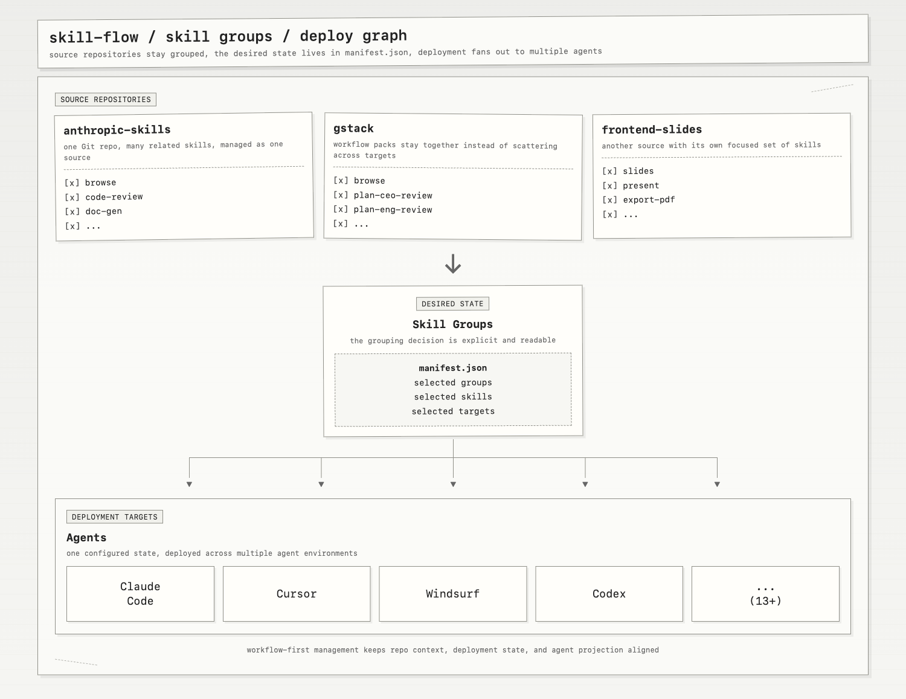

# Skill Flow

> **让 Skill 管理回归本质。**
> Skill 分组 · 一键部署到多个工具 · 配置清晰 · 问题快速定位


[English](./README.md)

[](https://nodejs.org)
[](./LICENSE)

当你的 Skill 越装越多，管理就会变得混乱：从 Github 仓库下载了一堆相关技能，部署到不同 agent 后结构被打散，更新和排障变得困难。

`skill-flow` 用 Skill 视角重新组织管理：以 Github 仓库作为 Skill 分组依据，选择部署目标，统一更新，快速诊断问题。让 Skill 管理清晰、可控、高效。

## 核心特性


**Skill 分组管理**
一个 Github 仓库 = 一个 Skill 分组。相关 Skills 保持在一起，更新和维护以分组为单位进行。

**一键部署到多个工具**
一次配置，部署到多个 agent（Claude Code、Cursor、Windsurf 等 13+ 目标）。

**交互式终端 UI**
直观的 TUI 界面：查看分组 → 选择技能 → 选择目标 → 保存配置。

**进入 Config 自动自举**
`config` 会先立即渲染，再显示启动进度；启动阶段会识别 agent 根目录里尚未纳入管理的 skill，回填到 `skill-flow`，并在进入主界面前完成状态审计。

**显式状态追踪**
`manifest.json` 记录你的意图，`lock.json` 记录实际安装状态。状态清晰可查。

**一键体检**
`doctor` 命令检测断链、不一致、冲突，精准定位问题。

## 安装

需要 Node.js >= 20，当前版本针对 macOS 优化。

通过 npm 安装：

```bash
npm install -g skill-flow
skill-flow --help
```

不做全局安装也可以直接运行：

```bash
npx skill-flow --help
```

如果你要本地开发，再使用源码安装：

```bash
git clone https://github.com/VintLin/skill-flow.git
cd skill-flow
npm install
npm run build
npm link
```

## 快速开始

```bash
# 添加技能源
skill-flow add /path/to/skills-repo

# 查看 Skill 分组
skill-flow list

# 交互式配置（选择技能和目标）
skill-flow config

# 更新所有源
skill-flow update --all

# 健康检查
skill-flow doctor

# 移除 Skill 分组
skill-flow uninstall my-source-id
```

`add <source>` 支持本地路径、`owner/repo`、完整的 https/ssh Git URL、GitHub tree URL，以及 `clawhub:<slug>[@version]`。

`add` 默认会预选该源的全部 skill，以及当前检测到的全部 agent 目标。传入 `--path <repoSubpath>` 时，仍然会导入整个仓库，但只会预选该路径下的 skill。

示例：

```bash
# 本地仓库
skill-flow add ~/code/my-skills

# GitHub 简写
skill-flow add garrytan/gstack

# 完整 Git URL
skill-flow add https://github.com/garrytan/gstack.git
skill-flow add git@github.com:garrytan/gstack.git

# GitHub tree URL
skill-flow add https://github.com/garrytan/gstack/tree/main/skills

# 导入整个仓库，但只预选某个子路径下的 skill
skill-flow add garrytan/gstack --path skills

# ClawHub 包
skill-flow add clawhub:example/skill-pack
skill-flow add clawhub:example/skill-pack@1.2.3
```

## 命令参考

| 命令 | 说明 |
|---|---|
| `add <source>` | 添加技能源（本地路径、Git 仓库或 ClawHub） |
| `find <query>` | 搜索本地已安装技能、内置 Git 仓库和 ClawHub |
| `search <query>` | `find` 的别名 |
| `list` | 显示 Skill 分组 |
| `config` | 打开交互式配置界面 |
| `update [sourceId] --all` | 更新所有技能并重新部署 |
| `doctor` | 体检，排查问题 |
| `uninstall <sourceIds...>` | 移除 Skill 分组及其部署 |

当已选 skill 出现同名冲突时，`skill-flow` 会把内容完全相同的重复项保留为 warning，把内容不同的冲突项改成带 repo / author 前缀的链接名，例如 `gstack-browse`、`gstack(garrytan)-browse` 或 `garrytan-skill-creator`。

## 工作原理

**状态管理**
- `~/.skillflow/manifest.json` - 你的配置（你想要什么）
- `~/.skillflow/lock.json` - 实际状态（实际装了什么）
- `~/.skillflow/source/local/<source-id>/` - 本地导入源，以及启动时接管的外部 skill
- `~/.skillflow/source/git/<source-id>/` - Git 仓库缓存
- `~/.skillflow/source/clawhub/<source-id>/` - ClawHub 缓存
- `~/.skillflow/catalog/git/<source-id>/` - 内置 Git 仓库缓存

**部署策略**
优先使用符号链接，必要时使用文件复制。目标目录只是部署点，真正的状态在 lock.json 里。

**Config 启动时会做什么**
- 检测当前可用 agent 目标
- 扫描已知 agent `skills/` 根目录中的未受管 skill
- 将这些外部 skill 导入到 `~/.skillflow/source/local/`
- 刷新 inventory、归一化 bindings、审计当前投影状态
- 然后进入交互式 config 界面

如果某个 agent 根目录里的 symlink 本来就已经指向 `~/.skillflow/source/*` 下的受管内容，bootstrap 会把它视为已管理状态，不会重复回填。

## 支持的 Agent

Claude Code · Codex · Cursor · GitHub Copilot · Gemini CLI · OpenCode · OpenClaw · Pi · Windsurf · Roo Code · Cline · Amp · Kiro

可通过环境变量自定义目标路径（如 `SKILL_FLOW_TARGET_CLAUDE_CODE`）。

更广义的生态路径参考，包括 project 级 rules / instructions 路径（文档整理中）。

## 默认内置发现仓库

`find/search` 除了搜索本地已安装技能和 ClawHub，也会搜索默认内置的 Git 仓库目录。

如果希望内置 Git 仓库搜索更稳定，建议设置 `GITHUB_TOKEN`，避免 GitHub 未认证 API 的低速率限制。

| Repository | Description | Stars | Skills |
| --- | --- | ---: | ---: |
| [anthropic-skills](https://github.com/anthropics/skills) | Official Agent Skills from Anthropic | 95,957 | 18 |
| [superpowers](https://github.com/obra/superpowers) | Agentic skills framework & development methodology | 89,816 | 14 |
| [everything-claude-code](https://github.com/affaan-m/everything-claude-code) | Performance optimization system for Claude Code, Codex, and beyond | 81,392 | 147 |
| [agency-agents](https://github.com/msitarzewski/agency-agents) | Specialized expert agents with personality and proven deliverables | 50,749 | — |
| [ui-ux-pro-max-skill](https://github.com/nextlevelbuilder/ui-ux-pro-max-skill) | Design intelligence for building professional UI/UX | 43,112 | 7 |
| [antigravity-awesome-skills](https://github.com/sickn33/antigravity-awesome-skills) | 1,000+ battle-tested skills for Claude Code, Cursor, and more | 25,047 | 1,258 |
| [marketingskills](https://github.com/coreyhaines31/marketingskills) | Marketing skills — CRO, copywriting, SEO, analytics, growth | 14,099 | 33 |
| [agentskills](https://github.com/agentskills/agentskills) | Specification and documentation for Agent Skills | 13,342 | — |
| [taste-skill](https://github.com/Leonxlnx/taste-skill) | Gives your AI good taste — stops generic, boring output | 3,389 | 5 |
| [affiliate-skills](https://github.com/Affitor/affiliate-skills) | Full affiliate marketing funnel: research to deploy | 99 | 47 |
| [skills](https://github.com/luongnv89/skills) | Reusable skills to supercharge your AI agents | 1 | 29 |
| [awesome-claude-skills](https://github.com/ComposioHQ/awesome-claude-skills) | Community Claude skills collection | — | — |
| [myclaude](https://github.com/cexll/myclaude) | Personal Claude skills collection | — | — |
| [baoyu-skills](https://github.com/JimLiu/baoyu-skills) | Community skills collection | — | — |
| [dbskill](https://github.com/dontbesilent2025/dbskill) | Database-focused skills collection | — | — |
| [gstack](https://github.com/garrytan/gstack) | Gstack skills and workflows | — | — |
| [impeccable](https://github.com/pbakaus/impeccable) | Design and taste skills collection | — | — |
| [frontend-slides](https://github.com/zarazhangrui/frontend-slides) | Frontend presentation skills collection | — | — |

## 开发

```bash
npm install
npm run build   # 构建
npm test        # 运行测试
npm run -w skill-flow dev  # CLI 开发模式
```

工作区结构：

- `apps/cli`：对外发布的 npm CLI 包（`skill-flow`）
- `packages/core`：共享领域模型 / 服务 / 状态逻辑
- `packages/tui`：Ink 终端 UI 模块
- `packages/shared-types`：bridge 协议契约
- `packages/bridge`：桌面端进程调用 bridge client
- `apps/desktop-mac`：SwiftUI 桌面壳（macOS 15+）

桌面/辅助进程机器协议入口：

```bash
printf '%s' '{"protocolVersion":"1.0","command":"list"}' | skill-flow bridge --json
```

技术栈：TypeScript + Vitest + Ink TUI + SwiftUI（桌面壳）

## 许可证

Apache License 2.0。见 [LICENSE](./LICENSE)。
