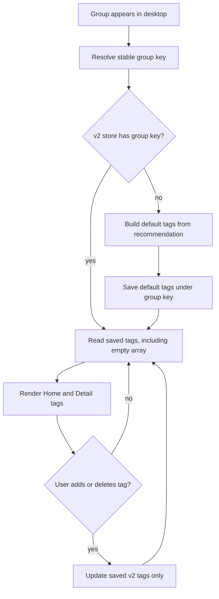

# Group Tag Persistence Design

## Context

Desktop group tags currently mix two meanings in one path:

- Default recommendation tags are derived at render time when no custom tag record exists.
- User-created and user-deleted tags are stored by `sourceId`.

This makes tags unstable. A group refresh can change the derived recommendation inputs or the displayed `sourceId`, so tags can disappear or appear to change even though the user expects the group's labels to stay fixed.

## Goal

Group tags must behave as user-owned group metadata after first display:

- A default recommendation tag is an initial tag for the group.
- User-created tags and default tags have the same behavior.
- Deleting a default tag removes it from that group.
- Refreshing a group or rebuilding the desktop controller must not restore, remove, or change saved tags.
- Empty tags are a valid saved state.

## Non-Goals

- Do not add a tag rename UI. In this task, editing means deleting or adding tags.
- Do not preserve compatibility with old desktop tag data.
- Do not move tags into the CLI/core state schema.
- Do not change CLI, TUI, bridge protocol, or storage package behavior.

## Design Summary

Use a desktop-local v2 tag store keyed by a stable group identity instead of by `sourceId`.

Recommendation tags are used only to initialize a group's saved tags when the group has no v2 entry. After initialization, all reads and mutations use the saved v2 entry only.



## Data Model

Keep `GroupTagPreference` as the tag item type:

```swift
struct GroupTagPreference: Codable, Equatable {
    let title: String
    let accentRawValue: String
    let tagId: String?
}
```

Add a v2 collection shape:

```swift
struct GroupTagCollection: Codable, Equatable {
    let schemaVersion: Int
    var tagsByGroupKey: [String: [GroupTagPreference]]
}
```

Use a new UserDefaults key:

```text
desktop.groupTags.v2.tagsByGroupKey
```

The old key `desktop.groupTags.customTagsBySourceId` will not be migrated.

## Group Key

Resolve a stable key from the group's source metadata:

1. `repo:<canonicalRepo>` when `sourceCanonicalRepo` is available.
2. `locator:<normalizedLocator>` when a stable locator is available.
3. `source:<sourceId>` as a fallback.

Normalization trims whitespace and lowercases the key material. Locator normalization should also trim trailing slashes.

This keeps GitHub and skills.sh groups stable across locator format changes, while still supporting local and collection groups.

## Controller Behavior

`GroupTagController` becomes the single access point for group tag state:

- `resolvedTags` resolves the group key, initializes missing entries, then returns saved tags.
- `addCustomTag` appends to the saved v2 array for the group key.
- `removeCustomTag` removes from the saved v2 array for the group key.
- `canAddTag`, `hasTags`, `homeSnapshot`, and suggestions read the saved v2 arrays.

Default recommendation lookup remains in the controller, but only as an initialization source. It must not be consulted for a group key that already exists in v2 storage.

## Display Behavior

Home cards, Home sidebar filters, and Detail tags continue to render through `GroupTagController`.

Deleting a default tag saves the resulting array. If the array is empty, the group displays no tags and the recommendation tag does not reappear after refresh.

## Error Handling

If the v2 store cannot decode, treat it as empty and rebuild entries as groups appear. This matches the intentionally non-compatible v2 behavior.

If saving fails because encoding returns nil, keep the in-memory state for the current session. No toast is required because current store writes also do not surface persistence failures.

## Testing

Add focused tests in `GroupTagControllerTests`:

- When a recommended group is first resolved, its default tag is saved to v2 storage.
- When a default tag is deleted, refreshing or rebuilding the controller keeps the tag absent.
- When a custom tag is added, rebuilding the controller keeps the tag.
- When the same group has a changed `sourceId` but the same canonical repo, saved tags still resolve.
- When a group key is saved with an empty array, recommendations do not repopulate it.

Run the desktop test target after implementation:

```bash
swift test --package-path apps/desktop-mac
```

## Scope

Expected code changes:

- `apps/desktop-mac/Sources/DesktopApp/Store/GroupTagState.swift`
- `apps/desktop-mac/Sources/DesktopApp/Runtime/DesktopGroupTagStore.swift`
- `apps/desktop-mac/Sources/DesktopApp/ViewModels/GroupTagController.swift`
- Narrow call-site updates in Home/Detail containers if source metadata needs to be passed differently.
- `apps/desktop-mac/Tests/SkillFlowDesktopTests/GroupTagControllerTests.swift`

No package outside `apps/desktop-mac` should change for this fix.
