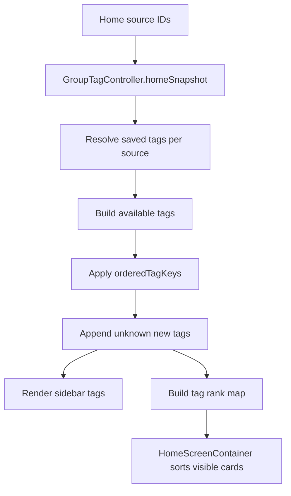

# Home Group Card Tag Order Design

## Context

The desktop Home page currently sorts group cards by pin rank and display name. Group tags are desktop-local user metadata managed by `GroupTagController`, and the Home sidebar builds its tag chips from `GroupTagController.HomeSnapshot.availableTags`.

The new behavior must make the Home group card order follow the user's tag order in the sidebar. The sidebar tag chips themselves must support horizontal drag reordering. The `All` chip stays fixed at the front and is not part of the user tag order.

## Goals

- Sort Home group cards by:
  1. pinned groups first,
  2. the group's first tag according to the Home sidebar tag order,
  3. groups with no tags after tagged groups,
  4. group name initial or first-character pinyin, then full stable name order.
- Persist one global user tag order across project scopes.
- Let users reorder real tag chips in the Home sidebar by dragging and inserting before or after another tag.
- Keep `GroupTagController` as the single access point for tag metadata and tag order.
- Keep `All` fixed first and non-draggable.

## Non-Goals

- Do not add a per-project tag order.
- Do not add a new primary-tag concept. The first tag on a group is the sorting tag.
- Do not change CLI, TUI, bridge protocol, or storage package behavior.
- Do not change group tag creation, deletion, recommendation initialization, or the maximum tag count.
- Do not make status, source type, agent, or project sidebar chips draggable.

## Design Summary

Extend the desktop-local group tag collection with a global ordered list of tag keys:

```swift
struct GroupTagCollection: Codable, Equatable {
    static let currentSchemaVersion = 2

    var schemaVersion: Int
    var tagsByGroupKey: [String: [GroupTagPreference]]
    var orderedTagKeys: [String]
}
```

`orderedTagKeys` uses the existing tag identity rules:

- preset tag: `preset:<tagId>`
- custom tag: `custom:<normalized title>`

The field defaults to an empty array so existing v2 stored tag data can decode without being cleared.
Because Swift synthesized `Decodable` does not supply defaults for missing fields, `GroupTagCollection` must add explicit decoding that reads `orderedTagKeys` with `decodeIfPresent` and falls back to `[]`. The schema version can remain `2` because the stored shape is backward-compatible when the new field is absent.



## Data Ownership

`GroupTagController` owns all tag order operations:

- `homeSnapshot` returns `availableTags` in user order.
- `homeSnapshot` exposes enough ranking data for Home card sorting.
- A new reorder method updates `orderedTagKeys` and saves the tag collection through `DesktopGroupTagStore`.

`MainViewModel` continues to construct raw `GroupCardModel` values and maintain pin state. It should not take a dependency on `GroupTagController`.

`HomeScreenContainer` is the right boundary for final Home card ordering because it already receives both raw cards and the `HomeSnapshot`.

## Sidebar Tag Order

When `homeSnapshot` builds available tags:

1. Collect unique visible tags from the resolved tags of current Home source IDs.
2. Partition collected tags by `orderedTagKeys`.
3. Emit tags whose keys appear in `orderedTagKeys` in that order.
4. Append collected tags that are not yet in `orderedTagKeys`, sorted by the existing default tag title ordering.
5. Persist the reconciled order when new visible tag keys are appended.

The global order must not remove a key merely because that tag is hidden by the current project scope or active filters. Cleanup may remove a key only when it no longer appears anywhere in `tagCollection.tagsByGroupKey`.

`All` is created only in `MainView.homeTagChipItems` and is never written to `orderedTagKeys`.

## Home Card Sorting

Home card sorting runs after status, source type, agent, search, and tag filters have produced the visible card set.

Comparator order:

1. Pin rank:
   - pinned cards sort before unpinned cards;
   - pinned cards keep `pinnedSourceIds` order.
2. First tag rank:
   - use `homeSnapshot.tagsBySourceID[card.id]?.first`;
   - lower sidebar tag rank sorts first;
   - cards with no first tag sort after all tagged cards.
3. Name sort key:
   - trim group title;
   - for Chinese text, apply Mandarin-to-Latin transform, strip combining marks, and fold case/diacritics;
   - for other text, fold case/diacritics;
   - compare the full resulting key, which naturally honors initial or pinyin first while staying stable for same initials.
4. Source ID as the final deterministic tie-breaker.

This preserves the confirmed priority: pinned, first tag, no-tag-last, group name initial or pinyin with full stable ordering.

## Drag Reordering

Only the Home sidebar `tags` section enables reorder behavior for real tag chips.

Expected interaction:

- `All` stays fixed first and cannot be dragged or targeted as a real tag order item.
- Dragging a real tag chip over another real tag chip inserts it before or after that target according to pointer position.
- The collapsed horizontal `ScrollView` supports left/right drag reordering.
- The expanded wrapped layout shows the same linear order. It can accept drops onto target chips and update order on drop; complex cross-row animation is not required for the first implementation.

The UI delegates reorder requests to `HomeScreenContainer`, which delegates to `GroupTagController`.

## Error Handling

- If stored tag collection decoding fails, keep the current `DesktopGroupTagStore` behavior and return an empty collection.
- If `orderedTagKeys` contains stale keys, ignore them in the rendered snapshot and remove them during reconciliation.
- If saving fails because encoding returns nil, keep in-memory order for the current session and do not show a toast. This matches existing group tag persistence behavior.
- If a reorder request references missing source or target tag keys, ignore the request.

## Testing

Add focused tests:

- `GroupTagControllerTests` verifies `homeSnapshot.availableTags` follows `orderedTagKeys`.
- `GroupTagControllerTests` verifies unknown new tags are appended after saved ordered tags.
- `GroupTagControllerTests` verifies reordering saves `orderedTagKeys` to `DesktopGroupTagStore`.
- `GroupTagControllerTests` verifies `All` is not stored in `orderedTagKeys`.
- Home sorting tests verify visible cards sort by pinned status, first tag rank, no-tag-last behavior, pinyin/name key, and source ID tie-breaker.
- UI source or interaction regression tests verify only the Home tag chip section wires reorder behavior.

Run the desktop test target after implementation:

```bash
swift test --package-path apps/desktop-mac
```

## Scope

Expected code changes:

- `apps/desktop-mac/Sources/DesktopApp/Store/GroupTagState.swift`
- `apps/desktop-mac/Sources/DesktopApp/Runtime/DesktopGroupTagStore.swift`
- `apps/desktop-mac/Sources/DesktopApp/ViewModels/GroupTagController.swift`
- `apps/desktop-mac/Sources/DesktopApp/Screens/Home/HomeScreenContainer.swift`
- `apps/desktop-mac/Sources/DesktopApp/Screens/Home/MainView.swift`
- focused desktop tests under `apps/desktop-mac/Tests/SkillFlowDesktopTests/`

No package outside `apps/desktop-mac` should change for this feature.
