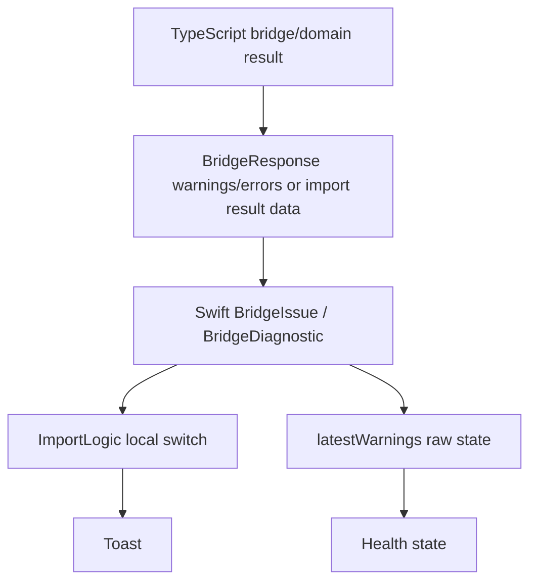
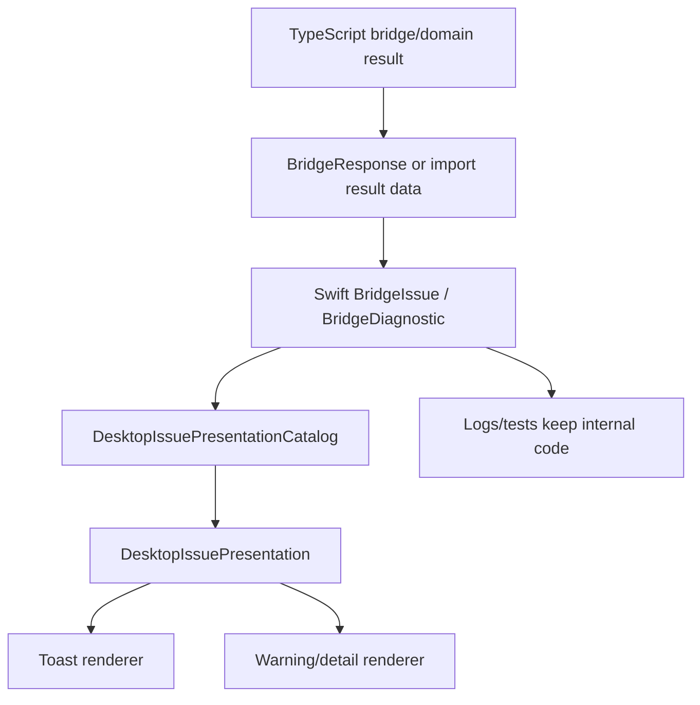

# Desktop Issue Presentation Catalog Design

## Context

Desktop import feedback currently mixes three different concepts:

- internal diagnostic codes such as `IMPORT_SELECTOR_NOT_FOUND`
- localized user-facing copy
- troubleshooting identifiers that should be short numeric issue codes such as `102`, `312`, or `502`

The current import path maps some `reasonCode` values directly in `ImportLogic.importFailureToastText(reasonCode:)`, while `ImportToastDiagnosticsFormatter` can append internal `IMPORT_*` and `BRIDGE_*` codes to a toast. Recent selector-drift handling also introduced warning codes that are useful for troubleshooting but should not block group import.

This creates two problems:

- UI copy can leak internal enum-style codes.
- Adding a new import failure or warning requires editing scattered switch statements and localization files without a single source of truth.

## Goal

Create one desktop-side issue presentation catalog that maps internal bridge/domain codes into user-facing presentation metadata.

The catalog should make every user-visible import issue answer:

- which numeric issue code should be shown
- which localized toast text should be used
- which localized detail text should be used when more context is available
- which internal code remains available for logs and tests
- which contextual fields are safe to show, such as skill name, selector value, group locator, or target

## Non-Goals

- Do not change the bridge protocol shape in this change.
- Do not replace internal `IMPORT_*`, `BRIDGE_*`, or provider reason codes.
- Do not add numeric issue codes to TypeScript domain result types yet.
- Do not surface internal enum-style codes in toast copy.
- Do not redesign the warning or health UI beyond creating a presentation-ready model.

## Terminology

- Internal code: existing machine-oriented values such as `IMPORT_SELECTOR_NOT_FOUND`, `BRIDGE_REQUEST_INVALID`, or `provider_rate_limited`.
- Issue code: short user-facing numeric code such as `102`, `312`, or `502`.
- Toast copy: short localized immediate feedback.
- Detail copy: localized troubleshooting text that may include skill name, selector/path, target, group locator, and issue code.
- Diagnostic context: structured values from `BridgeDiagnostic.details`, `BridgeIssue.message`, and import request context.

## Current State

### Existing Data Flow



### Existing Gaps

- `ImportLogic.importFailureToastText(reasonCode:)` is the main import toast mapping, but it is private and local to import logic.
- `toast.import.failed.reason_code` formats the raw internal code into UI copy.
- `ImportToastDiagnosticsFormatter` is named as a toast helper and currently formats internal codes into a string.
- `latestWarnings` stores raw `BridgeIssue` values and `HealthStatus` only checks whether the array is empty.
- There is no numeric issue code field or catalog.
- Tests currently assert internal code visibility in some desktop import diagnostics.

## Proposed Design

### 1. Add A Single Presentation Catalog

Add a desktop-side catalog in the runtime or presentation model layer, for example:

```swift
enum DesktopIssuePresentationCatalog {
    static func presentation(
        forInternalCode code: String?,
        diagnostics: [BridgeDiagnostic] = [],
        context: DesktopIssueContext = .empty
    ) -> DesktopIssuePresentation
}
```

The catalog owns all mappings from internal codes to user-visible issue metadata.

```swift
struct DesktopIssuePresentation: Equatable, Sendable {
    let issueCode: String
    let severity: DesktopIssueSeverity
    let toastKey: String
    let detailKey: String
    let safeContextFields: Set<DesktopIssueContextField>
    let internalCode: String?
}
```

`internalCode` remains available for logs, debug views, and tests, but UI rendering must not display it unless a deliberately internal diagnostics surface is added later.

### 2. Add A Small Issue Context Model

Add a typed context model instead of passing raw dictionaries through UI formatting:

```swift
struct DesktopIssueContext: Equatable, Sendable {
    let skillName: String?
    let selectorKind: String?
    let selectorValue: String?
    let groupLocator: String?
    let target: String?
    let bridgeCode: String?
}
```

The context can be built from `BridgeDiagnostic.details` and import request state. Only fields allowed by `safeContextFields` should appear in user-facing detail copy.

### 3. Separate Toast Rendering From Diagnostic Detail Rendering

Replace `ImportToastDiagnosticsFormatter` with a detail-oriented formatter, for example:

```swift
enum DesktopIssueDetailFormatter {
    static func message(
        presentation: DesktopIssuePresentation,
        context: DesktopIssueContext,
        locale: Locale
    ) -> String
}
```

Toast rendering should use only `presentation.toastKey` and `presentation.issueCode`.

Detail rendering can use:

- issue code
- skill name
- selector/path
- target
- group locator

It must not render `IMPORT_*` or `BRIDGE_*` internal codes.

### 4. Issue Code Ranges

Use stable numeric ranges:

| Range | Area | Examples |
| --- | --- | --- |
| `1xx` | Import selection and skill matching | selector not found, selector ambiguous, selected skill missing |
| `2xx` | Provider/source metadata | unsupported provider, unavailable provider data, rate limit, invalid provider response |
| `3xx` | Import preparation and apply | checkout/prepare failed, preview invalid, apply failed, stale preparation |
| `4xx` | Local path and target | local scan failed, source path missing, agent target unavailable |
| `5xx` | Bridge/runtime | invalid bridge response, request rejected, helper missing, timeout |
| `6xx` | Desktop group operations | update, uninstall, rename, pin, save |
| `7xx` | Project scope, state, and health | project refresh, state migration, doctor/warnings |
| `8xx` | User validation | missing selection, empty name, duplicate tag |

The exact numeric assignments should live in the catalog, not in localization strings.

### 5. Full Desktop Presentation Audit

The catalog should cover every user-visible error or warning surface. Success, loading, and purely informational toasts remain normal localized copy unless they wrap an error or warning.

#### Bridge Errors

| Current key / source | Current behavior | Treatment |
| --- | --- | --- |
| `bridge.error.helper_missing` | Localized `BridgeClientError.helperMissing` | Catalog issue `501`; show localized message + issue code |
| `bridge.error.invalid_response` | Localized `BridgeClientError.invalidResponse` | Catalog issue `502`; no raw bridge code in UI |
| `bridge.error.timeout` | Localized timeout with ms | Catalog issue `503`; keep timeout ms as safe context |
| `bridge.error.empty_response` | Localized empty response | Catalog issue `504` |
| `bridge.error.concurrent_mutation` | Localized concurrent mutation | Catalog issue `505`; safe user-facing warning |
| `bridge.error.missing_dependency.node` | Localized dependency error with README URL | Catalog issue `506`; keep dependency name and URL |
| `bridge.error.missing_dependency.git` | Localized dependency error with README URL | Catalog issue `507`; keep dependency name and URL |
| `bridge.error.missing_dependency.npx` | Localized dependency error with README URL | Catalog issue `508`; keep dependency name and URL |
| `showBridgeCommandFailure(_:)` | Joins raw `response.errors.map(\.message)` into toast | Replace with catalog mapping from `BridgeIssue.code`; fallback issue `599` |

#### Import Toasts And Import Page Errors

| Current key / source | Current behavior | Treatment |
| --- | --- | --- |
| `toast.import.failed` with `error.localizedDescription` | Wraps arbitrary error text | Replace for bridge/domain errors with catalog; keep only as non-structured fallback `599` |
| `toast.import.invalid_response` | Generic invalid import response | Catalog issue `502` for bridge shape failure or `302` for import preview/apply invalid data |
| `toast.import.failed.provider_not_supported` | Provider unsupported | Catalog issue `201` |
| `toast.import.failed.provider_data_unavailable` | Provider data unavailable | Catalog issue `202` |
| `toast.import.failed.provider_rate_limited` | Provider rate limited | Catalog issue `203` |
| `toast.import.failed.provider_response_invalid` | Provider response invalid | Catalog issue `204` |
| `toast.import.failed.provider_request_failed` | Provider request failed | Catalog issue `205` |
| `toast.import.failed.no_valid_leafs` | No recognizable skill files | Catalog issue `401` |
| `toast.import.failed.source_path_not_found` | Selected path has no valid skill | Catalog issue `402` |
| `toast.import.failed.add_agent_not_available` | Agent target unavailable | Catalog issue `403`, include target when available |
| `toast.import.failed.add_skill_not_found` | Selected skill missing | Catalog issue `104`, include skill/selector when available |
| `toast.import.failed.import_prepare_failed` | Checkout/prepare failed | Catalog issue `301` |
| `toast.import.failed.invalid_response` | Invalid import response | Catalog issue `302` or `303` depending source code |
| `toast.import.failed.reason_code` | Displays raw internal code | Remove from call path; fallback to catalog issue `599` |
| `toast.import.failed.generic` | Generic import failure | Catalog fallback issue `599` |
| `toast.import.warning.selection_drift` | Warning after group import continues | Catalog issues `101`, `102`, or `103`; include numeric issue code |
| `toast.import.local_scan_failed` | Displays raw scan failure message | Catalog issue `404`; preserve local path/message as safe context only if not internal code |
| `import.reason.*` | Import card failure phase text | Use same catalog detail text without raw internal code |
| `ImportToastDiagnosticsFormatter` | Appends raw internal code details to toast | Replace with detail formatter that uses issue code and safe context |

#### Import Internal Code Mapping

Initial catalog entries should cover every import code currently surfaced by desktop import flows:

Initial catalog entries should cover every import code currently surfaced by desktop import flows:

| Internal code | Issue code | Toast key | Detail context |
| --- | --- | --- | --- |
| `IMPORT_SELECTOR_NOT_FOUND` | `101` | `toast.import.warning.selection_drift` for warning path, `toast.import.failed.selection_not_found` for failure path | skill name, selector kind/value, group locator |
| `IMPORT_SELECTOR_AMBIGUOUS` | `102` | `toast.import.warning.selection_drift` for warning path, `toast.import.failed.selection_ambiguous` for failure path | skill name, selector kind/value, group locator |
| `IMPORT_SELECTORS_UNRESOLVED_USED_ALL` | `103` | `toast.import.warning.selection_drift` | group locator |
| `ADD_SKILL_NOT_FOUND` | `104` | `toast.import.failed.add_skill_not_found` | skill name, group locator |
| `ADD_SKILL_SELECTOR_AMBIGUOUS` | `105` | `toast.import.failed.selection_ambiguous` | skill name, selector value |
| `IMPORT_SELECTOR_INVALID` | `106` | `toast.import.failed.selection_invalid` | selector kind/value |
| `provider_not_supported` | `201` | `toast.import.failed.provider_not_supported` | group locator |
| `provider_data_unavailable` | `202` | `toast.import.failed.provider_data_unavailable` | group locator |
| `provider_rate_limited` | `203` | `toast.import.failed.provider_rate_limited` | group locator |
| `provider_response_invalid` | `204` | `toast.import.failed.provider_response_invalid` | group locator |
| `provider_request_failed` | `205` | `toast.import.failed.provider_request_failed` | group locator |
| `IMPORT_PREPARE_FAILED` | `301` | `toast.import.failed.import_prepare_failed` | group locator |
| `IMPORT_PREVIEW_INVALID` | `302` | `toast.import.failed.invalid_response` | group locator |
| `IMPORT_APPLY_FAILED` | `303` | `toast.import.failed.invalid_response` | group locator |
| `IMPORT_PREPARATION_STALE` | `304` | `toast.import.failed.preparation_stale` | group locator |
| `IMPORT_PREPARATION_MISSING` | `305` | `toast.import.failed.preparation_stale` | group locator |
| `NO_VALID_LEAFS` | `401` | `toast.import.failed.no_valid_leafs` | group locator |
| `SOURCE_PATH_NOT_FOUND` | `402` | `toast.import.failed.source_path_not_found` | group locator |
| `ADD_AGENT_NOT_AVAILABLE` | `403` | `toast.import.failed.add_agent_not_available` | target |
| `LOCAL_IMPORT_SCAN_FAILED` | `404` | `toast.import.local_scan_failed` | local path |
| `BRIDGE_REQUEST_INVALID` | `501` | `toast.import.failed.invalid_response` | bridge command |
| `BRIDGE_IMPORT_DRAFT_REJECTED` | `502` | `toast.import.failed.invalid_response` | bridge command |
| unknown or empty code | `599` | `toast.import.failed.generic` | none |

Issue codes can be revised before implementation, but once shipped they should remain stable.

#### Desktop Operation Toasts

| Current key / source | Current behavior | Treatment |
| --- | --- | --- |
| `toast.pin.failed` | Error with first error line | Catalog issue `601`; use source/group context when available |
| `toast.details.load_failed` | Error with source id | Catalog issue `602`; use group/source display name when available |
| `toast.update.no_group_selected` | User selection validation | Issue `801` only if shown as error; otherwise can remain plain validation copy |
| `toast.update.failed` | Error with localized description | Catalog issue `603`; map structured bridge/domain errors when available |
| `toast.uninstall.no_group_selected` | User selection validation | Issue `802` only if kept as error toast |
| `toast.uninstall.failed` | Error with localized description | Catalog issue `604` |
| `toast.rename.empty` | User input validation | Issue `803` only if kept as error toast |
| `toast.rename.failed` | Error with first error line | Catalog issue `605` |
| `toast.save.no_source_id` | Internal missing source id | Catalog issue `606`; should include action context, not raw id label only |
| `toast.save.failed` | Error with first error line | Catalog issue `607` |
| `toast.pinned_migration.failed` | Error with first error line | Catalog issue `701` |
| `toast.project_scope.refresh.failed` | Project refresh error with localized description | Catalog issue `702` |

#### Tag Validation Toasts

| Current key / source | Current behavior | Treatment |
| --- | --- | --- |
| `group_tag.toast.duplicate` | Plain validation | Keep normal i18n; no issue code required unless support wants validation codes |
| `group_tag.toast.limit` | Plain validation | Keep normal i18n |
| `group_tag.toast.empty` | Plain validation | Keep normal i18n |
| `group_tag.toast.not_found` | Stale tag validation | Consider catalog issue `804` only if it comes from persisted state drift |

#### Warning And Health Surfaces

| Current source | Current behavior | Treatment |
| --- | --- | --- |
| `latestWarnings: [BridgeIssue]` | Stored raw and only affects health status | Add presentation-ready warning rows through catalog |
| `HealthStatus.warnings` | Shows warning icon only | Keep icon behavior; details should render catalog rows |
| `DoctorIssueRow` / doctor issues | Domain diagnostics shown separately | Keep domain severity, add issue code mapping for known doctor codes in `7xx` |
| Group/card `warningCount` | Count only | Keep count; if details are exposed, use catalog rows |

#### Backend/Internal Codes Observed During Audit

These internal codes should not be displayed directly in desktop UI. The first implementation should map codes that can currently reach desktop toasts/details; remaining codes can be added when their UI surface is introduced.

| Area | Internal codes observed | Treatment |
| --- | --- | --- |
| Import selection | `IMPORT_DRAFT_SELECTED_SKILLS_REQUIRED`, `IMPORT_SELECTOR_INVALID`, `IMPORT_SELECTOR_AMBIGUOUS`, `IMPORT_SELECTOR_NOT_FOUND`, `IMPORT_SELECTORS_UNRESOLVED_USED_ALL`, `ADD_SKILL_SELECTOR_AMBIGUOUS`, `ADD_SKILL_NOT_FOUND`, `DUPLICATE_LEAF_SELECTION_SKIPPED` | Map to `1xx`; drift warnings do not block group import |
| Provider/source metadata | `provider_not_supported`, `provider_data_unavailable`, `provider_rate_limited`, `provider_response_invalid`, `provider_request_failed`, `IMPORT_SEARCH_FAILED`, `BUILTIN_SOURCE_UNAVAILABLE`, `BUILTIN_SOURCE_STALE_CACHE_USED` | Map provider import failures to `2xx`; cache/source availability warnings to `7xx` if surfaced |
| Import preparation/apply | `IMPORT_PREPARE_FAILED`, `IMPORT_PREVIEW_INVALID`, `IMPORT_APPLY_FAILED`, `IMPORT_PREPARATION_STALE`, `IMPORT_PREPARATION_MISSING`, `IMPORT_PREPARATION_COMMITTING`, `COLLECTION_CHECKOUT_UNSUPPORTED` | Map to `3xx` |
| Local path/target | `NO_VALID_LEAFS`, `SOURCE_PATH_NOT_FOUND`, `LOCAL_IMPORT_SCAN_FAILED`, `ADD_AGENT_NOT_AVAILABLE`, `PROJECT_SCOPE_PATH_UNAVAILABLE`, `TARGET_UNKNOWN`, `TARGET_PROJECTION_DRIFT` | Map import-local/target cases to `4xx`; project/doctor target issues to `7xx` |
| Bridge/runtime | `BRIDGE_EMPTY_REQUEST`, `BRIDGE_REQUEST_INVALID`, `UNSUPPORTED_COMMAND`, `UNCAUGHT_EXCEPTION` | Map to `5xx` |
| Group operations | `SOURCE_NOT_FOUND`, `COLLECTION_NOT_FOUND`, `COLLECTION_RESTORE_UNAVAILABLE`, `COLLECTION_NAME_EMPTY`, `COLLECTION_SKILLS_EMPTY`, `MERGE_GROUPS_TOO_FEW`, `COLLECTION_ORIGIN_MISSING`, `COLLECTION_ORIGIN_UNAVAILABLE`, `COLLECTION_ORIGIN_HASH_CHANGED`, `COLLECTION_SKILL_NAME_CONFLICT`, `COLLECTION_MEMBER_ORIGIN_MISSING`, `COLLECTION_MATERIALIZATION_FAILED`, `GROUP_DELETE_INCOMPLETE`, `GROUP_DELETE_PATH_FAILED`, `LEAF_NOT_FOUND`, `SOURCE_LOCK_MISSING` | Map user-visible desktop operation failures to `6xx`; keep non-UI internal codes out of toast |
| Checkout/deployment warnings | `BROKEN_SYMLINK`, `REPAIR_TARGETS_SKIPPED_BOOTSTRAP_IMPORTED`, `SOURCE_CHECKOUT_MISSING`, `SOURCE_CHECKOUT_PRUNE_SKIPPED`, `SOURCE_CHECKOUT_PRUNE_FAILED`, `ORPHAN_TARGET_SYMLINK_REMOVED`, `DETACHED_TARGET_SYMLINK_REMOVED`, `IMPORTED_TARGET_PATH_INVALID`, `IMPORTED_TARGET_PATH_REMOVE_FAILED`, `MISSING_LEAF_SELECTION`, `EXTERNAL_NAME_COLLISION_RENAMED`, `EXTERNAL_SKILL_RELOCATED` | Map warning/details to `7xx` when shown in health/doctor details |
| State migration | `STATE_MIGRATION_INCOMPLETE`, `STATE_MIGRATION_BLOCKED`, `STATE_SCHEMA_UNSUPPORTED`, `STATE_AUTHORITY_FIELD_INVALID`, `STATE_MIGRATION_GENERATION_MISMATCH`, `STATE_MIGRATION_VALIDATION_FAILED`, `STATE_MIGRATION_GITHUB_CHECKOUT_CONFLICT`, `STATE_MIGRATION_VIRTUAL_MEMBER_ORIGIN_MISSING`, `STATE_MIGRATION_LEGACY_SOURCE_ORPHANED`, `STATE_MIGRATION_COLLECTION_HASH_MISMATCH` | Map to `7xx`; do not put raw state codes in desktop toast |
| Metadata/doctor | `LEAF_METADATA_WARNING`, `SKILL_METADATA_WARNING`, `INVALID_LEAF`, `DUPLICATE_LEAF`, `TARGET_UNAVAILABLE`, `INVALIDATED_SELECTED_LEAF`, `LEAF_MISSING`, `DRIFT_NOT_DEPLOYED`, `TARGET_MISSING`, `DRIFT_TYPE`, `DRIFT_COPY`, `STALE_DEPLOYMENT`, `UNMANAGED_EXTERNAL_TARGET_SKILL` | Map doctor/detail display to `7xx`; do not change core diagnostic generation |

### 6. Toast Copy Rules

Toast copy should be localized and concise:

- Include numeric issue code when it helps support, for example `问题码：103`.
- Do not include `IMPORT_*`, `BRIDGE_*`, or provider enum strings.
- Prefer action/result wording over implementation detail.
- For group import selector drift, success should remain success semantics with a warning-style toast:
  - Chinese: `已按下载后的内容导入该组。部分原选择的 Skill 已变化。问题码：103。`
  - English: `Imported the group from the downloaded contents. Some selected skills changed. Issue code: 103.`
  - Japanese: same meaning in localized form.

### 7. Detail Copy Rules

Detail copy can be more specific:

- `Skill "%@" no longer matched the downloaded group. Issue code: 101.`
- `Selector "%@" matched more than one Skill in "%@". Issue code: 102.`
- `Agent target "%@" is unavailable. Issue code: 403.`

Detail copy should never display the internal code. Internal codes remain inspectable through logs or test-only structures.

### 8. Revised Data Flow



## Implementation Plan

1. Add `DesktopIssuePresentationCatalog`, `DesktopIssuePresentation`, and `DesktopIssueContext`.
2. Move import failure mapping out of `ImportLogic.importFailureToastText(reasonCode:)` into the catalog.
3. Replace `toast.import.failed.reason_code` usage with catalog fallback issue `599`.
4. Rename or replace `ImportToastDiagnosticsFormatter` so toast code no longer formats raw diagnostics.
5. Use the catalog for `importWarningToastText(warnings:)`.
6. Add localized strings for new failure/warning/detail keys in English, Simplified Chinese, and Japanese.
7. Update tests so UI copy assertions reject `IMPORT_*` and `BRIDGE_*` in toast output.
8. Add catalog unit tests that verify every known import internal code has an issue code and localization key.

## Testing Plan

### Unit Tests

- Catalog maps every known import internal code to a stable numeric issue code.
- Unknown internal codes map to issue code `599` and generic localized copy.
- Selection drift warnings map to issue codes `101`, `102`, or `103`.
- Toast text does not contain `IMPORT_`, `BRIDGE_`, or `ADD_SKILL_`.
- Detail formatter includes safe context fields such as skill name or selector value.
- Detail formatter does not include internal codes.

### Localization Tests

- All catalog toast keys exist in `en`, `zh-Hans`, and `ja`.
- All catalog detail keys exist in `en`, `zh-Hans`, and `ja`.
- Localized fallback no longer depends on `toast.import.failed.reason_code`.

### Import Flow Tests

- Selector-drift group import succeeds and shows warning toast with issue code `103`.
- Failed selector resolution shows mapped failure copy and numeric issue code.
- Bridge invalid response maps to issue code `501` without exposing `BRIDGE_REQUEST_INVALID`.
- Preparation failure maps to issue code `301`.

## Risks

- Assigning issue codes on the desktop side means CLI and desktop do not yet share a universal issue-code catalog. This is acceptable for this change because the immediate problem is desktop UI copy.
- If support workflows later need the same issue codes in CLI output, the catalog should move to a shared TypeScript-generated source of truth.
- Existing tests that assert raw internal codes in toast diagnostics must be rewritten to assert numeric issue codes and hidden internal codes.
- Adding many localization keys can drift unless the catalog tests require key coverage.

## Validation

Minimum validation after implementation:

- `swift test --package-path apps/desktop-mac`
- `npm test`
- `npm run build`

Focused manual validation:

- Import a searched GitHub group whose original selected skill no longer matches after download.
- Confirm group import succeeds.
- Confirm toast shows localized copy and numeric issue code.
- Confirm toast does not show `IMPORT_*` or `BRIDGE_*`.
- Confirm warning/detail surface includes skill or selector context when available.

## Completion Criteria

- Desktop import toasts never show internal enum-style codes.
- User-visible issue codes are numeric and centrally assigned.
- Import failure and warning presentation flows use one catalog.
- Selection drift no longer blocks group import and shows a localized warning with an issue code.
- Tests cover catalog mappings, localization keys, and absence of internal codes in toast copy.

## Self-Review

- The design keeps internal diagnostic codes as the protocol-level source of truth and adds only a presentation mapping layer, so it does not duplicate business behavior.
- The catalog is intentionally desktop-side for now because the current leak is in desktop UI; moving it to shared TypeScript would be broader and should wait until CLI needs numeric issue codes too.
- The proposed context model prevents raw diagnostic dictionaries from becoming UI copy.
- The initial mapping covers the currently observed import codes from desktop import flow, query runtime, import preparation, and bridge errors.
